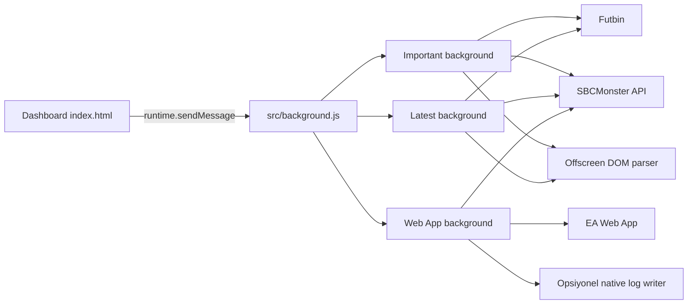

# FutbinSync Chrome Eklentisi Teknik Dokumani

> Inceleme tarihi: 2026-07-08  
> Incelenen kok: `SyncApps/FutbinSync/`  
> Manifest: Chrome Extension Manifest V3  
> Kapsam: Dashboard, service worker, Important Players, Latest Player ve Web App Sync modullerinin mevcut kaynak kodu

## 1. Dokumanin Amaci

Bu dokuman FutbinSync eklentisinin mevcut kod tabanini gelistirici bakis acisiyla aciklar. Amaclari:

- Eklentinin calisma zamanindaki mimarisini gostermek.
- Her modulun baslangic, tarama, parse, API ve tamamlanma akislarini belgelemek.
- Chrome message, storage ve alarm sozlesmelerini tek yerde toplamak.
- API endpointlerini ve tasinan veri tiplerini ozetlemek.
- Otomatik calisma, hata, retry ve resume davranislarini aciklamak.
- Guvenlik, bakim ve test risklerini gorunur kilmak.

Bu belge `.env` icindeki gercek kimlik bilgilerini veya gizli degerleri icermez.

## 2. Yonetici Ozeti

FutbinSync tek bir Chrome eklentisi icinde uc bagimsiz senkronizasyon motoru calistirir:

1. **Important Players**: Futbin oyuncu listesini filtreli URL'den sayfa sayfa okur, bes sayfalik batch'ler halinde backend'e yollar ve saatlik tekrar planlar.
2. **Latest Player Sync**: Futbin `/latest` listesinin ilk iki sayfasini okur, yeni/guncellenen coin card kayitlarini belirler, kart detaylarini senkronize eder ve manuel baslatma disinda yeniden calismaz.
3. **Web App Sync**: EA FC Web App'e giris yapar, rarity ve SBC verilerini once Ingilizce, gerekli ise Turkce olarak tarar; production API'ye yazar ve gunluk watchdog ile otomatik calisir.

Aktif kullanici arayuzu `index.html` ve `src/dashboard.js` tarafindan olusturulan ortak dashboard'dur. Toolbar aksiyonu popup acmak yerine dashboard'u yeni sekmede acar.



## 3. Dosya ve Sorumluluk Haritasi

### Kok dosyalar

| Dosya | Sorumluluk |
|---|---|
| `manifest.json` | MV3 izinleri, service worker, content script ve host tanimlari |
| `index.html` | Uc modullu ortak dashboard kabugu |
| `.env` | API, zamanlama ve EA login ayarlari; hassas dosya |
| `src/background.js` | Uc background modulunu import eder; toolbar tiklamasinda dashboard sekmesini acar |
| `src/dashboard.js` | Modul kartlari, komutlar, metrikler, loglar ve countdown render'i |
| `src/dashboard.css` | Ortak dashboard gorunumu ve Latest log durum ikonlari |
| `src/offscreen.html` | Important ve Latest offscreen parser iframe'lerini barindirir |

### Important Players

| Dosya | Sorumluluk |
|---|---|
| `src/modules/important/background.js` | Tarama dongusu, batch API POST, retry, alarm ve state yonetimi |
| `content.js` | Acilan Futbin sekmesinin HTML'ini background'a verir |
| `offscreen-parser.js` | HTML'i DOMParser ile oyuncu kayitlarina donusturur |
| `network.js` / `network.html` | API isteklerini XHR ile gonderen ayri network monitor sekmesi |
| `popup.*`, `compact.css` | Bagimsiz/legacy Important UI; ortak manifest action'i tarafindan acilmaz |

### Latest Player

| Dosya | Sorumluluk |
|---|---|
| `src/modules/latest/background.js` | Latest/coin-card state makinesi, API, log ve alarm yonetimi |
| `content.js` | `/latest`, coin card detail ve legacy club-player DOM parse islemleri |
| `offscreen.js` / `offscreen.html` | Background fetch ile gelen HTML'i DOM ortaminda parse eder |
| `popup.*` | Bagimsiz Latest panel UI'si; ortak dashboard disinda alternatif arayuz |
| `actions/futbinLatestCoinCards.js` | Coin-card liste ve satir render yardimcilari |

### Web App Sync

| Dosya | Sorumluluk |
|---|---|
| `src/modules/webapp/background.js` | Gunluk schedule/watchdog, tab, state, log, native messaging ve finalizasyon |
| `actions/webAppSync/page_api_bridge.js` | MAIN world icinden production API'ye fetch koprusu |
| `actions/webAppSync/app.js` | API istemcisi, log/toast, modal watcher ve UI action yardimcilari |
| `actions/webAppSync/core.js` | Login, dil degisimi ve EN/TR faz orkestrasyonu |
| `actions/webAppSync/sync_rarity.js` | Rarity tarama, dedupe ve bulk save |
| `actions/webAppSync/sync_sbc.js` | SBC kategori/tile/sub/requirement okuma ve API sync |
| `popup.*` | Gunluk schedule, 9 adimli progress ve son basari kayitlari UI'si |

## 4. Manifest ve Chrome Yetkileri

### Permissions

| Izin | Kullanim |
|---|---|
| `storage` | State, log, error, ayar ve faz checkpoint'leri |
| `alarms` | Important saatlik dongu; Web App daily/watchdog; aktif run timeout/gecisleri |
| `offscreen` | Fetch edilen Futbin HTML'ini DOM ile parse etmek |
| `tabs` | Dashboard, Futbin, EA Web App ve network monitor sekmeleri |
| `debugger` | EA login inputlarina gercek mouse eventi gondermek |
| `nativeMessaging` | Web App gunluk basari loglarini opsiyonel `logs.json` dosyasina yazmak |

### Host permissions

- `https://www.futbin.com/*`
- `https://futbin.com/*`
- EA Web App ve EA signin adresleri
- `https://api.sbcmonster.com/*`
- `http://localhost:5055/*`

### Content script yukleme sirasi

1. Latest content script Futbin sayfalarinda `document_start` aninda yuklenir.
2. Important content script ayni hostlarda `document_idle` aninda yuklenir.
3. Web App API bridge EA sayfasinda `MAIN` world ve `document_start` ile yuklenir.
4. Web App action/core/rarity/SBC dosyalari isolated world'de `document_idle` ile yuklenir.

Content script'ler ayni sayfalarda bulunsa da farkli message type'lari dinledikleri icin normal durumda birbirlerinin isini tetiklemez.

## 5. Ortak Dashboard

Dashboard her modul icin bir `sync-panel` uretir ve 2.5 saniyede bir snapshot yeniler. Storage degisiklikleri de anlik refresh tetikler.

### Komutlar

Dashboard mesajlari su ortak zarfi kullanir:

```js
{
  futbinSyncModule: "important" | "latest" | "webapp",
  type: "START_SYNC" | "STOP_SYNC" | "CLEAR_SYNC" | "GET_SNAPSHOT",
  ...payload
}
```

### Modul kartlari

| Modul | Gosterilen ana metrikler |
|---|---|
| Important | Sayfa, Parsed, Mapped, Saved, Skipped, Tur |
| Latest | YENI KAYIT, GUNCELLENEN |
| Web App | Adim, Saved, Skipped, Run, Saat, Tab |

### Latest `.log-line` davranisi

Latest player loglari URL, yoksa rating+oyuncu adi ile anahtarlanir. `card-processing` kaydi loader SVG ile gosterilir. Request tamamlandiginda background ayni log entry'sini storage'da gunceller:

- `new-card-detected` -> **Yeni Kayit Eklendi** + success SVG
- `card-updated` -> **Guncellendi** + success SVG

Dashboard ayni `data-log-key` degerine sahip DOM node'unu yeniden kullanir; ayri bir sonuc satiri acmak yerine mevcut satirin metnini ve ikonunu degistirir.

## 6. Background Modul Izolasyonu

`src/background.js` uc dosyayi ayni service worker global surecine import eder. Her background listener once `futbinSyncModule` alanini kontrol eder:

| Deger | Hedef |
|---|---|
| `important` | Important Players background |
| `latest` | Latest Player background |
| `webapp` | Web App background |

Bu ayrim zorunludur. Modul etiketi olmayan `START_SYNC` gibi mesajlar birlesik service worker tarafindan islenmez.

## 7. Important Players Modulu

### 7.1 Kaynak filtresi

Modul sabit bir Futbin players URL'si kullanir. Filtre mantigi:

- Console fiyat: 300-45.000
- Rating: 82-95
- Siralama: Player Rating, artan
- `eUnt=1`

### 7.2 Calisma akisi

1. `START_SYNC` yeni `runToken` olusturur ve state'i sifirlar.
2. Futbin sayfasi dogrudan `fetch` ile okunur.
3. HTTP 403/429 durumunda gizli Futbin sekmesi acilir ve `GET_FUTBIN_PAGE_HTML` ile HTML alinir.
4. HTML offscreen parser'a `PARSE_FUTBIN_HTML` mesaji ile gonderilir.
5. Oyuncular raw Futbin ID'leriyle API payload'ina map edilir.
6. Bes sayfa veya son sayfa tamamlaninca batch hazirlanir.
7. Batch `POST sync/futbin-player-clubs` endpoint'ine gonderilir.
8. Her API batch'i en fazla uc kez denenir.
9. Tur bitince bir saat sonraya yeni Important alarmi kurulur.

### 7.3 Batch payload ozeti

```json
{
  "page_from": 1,
  "page_to": 5,
  "pages_attempted": 5,
  "pages_succeeded": 5,
  "players": [],
  "sync_mode": "filtered_partial",
  "disable_missing_delete": true,
  "source": "futbin_filtered_players",
  "source_url": "...",
  "filter": {
    "ps_price": "300-45000",
    "player_rating": "82-95"
  }
}
```

### 7.4 Oyuncu parse alanlari

- Futbin player ID ve URL
- Ad, tam ad, rating
- Birincil ve alternatif pozisyonlar
- Console ve PC fiyatlari
- Nation/league/club adlari ve Futbin ID'leri
- Rarity ID
- Card/player/nation/league/club gorsel URL'leri

### 7.5 Dayaniklilik

- Page fetch: 3 deneme
- Batch POST: 3 deneme
- Request timeout: 30 saniye
- Gizli tab yukleme timeout: 60 saniye
- Stop: `runToken` artirir ve aktif `AbortController` istegini iptal eder

### 7.6 Zamanlama

Important Players bilincli olarak otomatik calisir. Basarili veya basarisiz turdan sonra varsayilan bir saatlik alarm planlanir. `STOP_SYNC` alarmi temizler ve `nextRunAt` degerini sifirlar.

## 8. Latest Player Modulu

### 8.1 Ana state makinesi

Latest runner kimligi `coin-cards`, operasyonu `coin-cards` degeridir. State su bilgileri tasir:

- Queue ve aktif job index
- Aktif URL, sayfa ve tab
- API URL ve wait suresi
- Latest liste snapshot'i
- Yeni/guncellenen coin-card ID listeleri
- Sayfa basari/hata sayilari
- Kayit sonuc toplamlari
- Run loglari ve hata

### 8.2 Baslatma oncesi hazirlik

`prepareLatestCoinCardRun` asagidaki sirayi izler:

1. Eski Latest loglarini temizler.
2. `run-start` logu yazar.
3. `DELETE CoinCard/deleteLowedRatioCards` ile dusuk ratio kartlari temizler.
4. `GET futbin-sync/coin-card-jobs` ile mevcut backend snapshot'ini alir.
5. `/latest` job'unu queue'ya ekler.

### 8.3 Latest liste okuma

- Sabit olarak ilk iki `/latest` sayfasi okunur.
- Her satirdan player name, URL, rating, position, gorseller ve Cross/PC fiyat+range bilgileri alinir.
- Asagidaki alti fiyat degeri pozitif olmak zorundadir:
  - Cross current/min/max
  - PC current/min/max
- Eksik fiyatli satir hata listesine gider ve POST'a dahil edilmez.
- URL bazli dedupe yapilir.

### 8.4 Latest liste API islemi

Toplanan kartlar `POST futbin-sync/coin-card-latest` endpoint'ine gonderilir:

```json
{
  "source_date": "...",
  "cards": [
    {
      "player_name": "...",
      "rating": 0,
      "position": "...",
      "url": "...",
      "player_img_url": "...",
      "bg_card_url": "...",
      "nation_img_url": "...",
      "min_price_cross": 0,
      "price_cross": 0,
      "max_price_cross": 0,
      "min_price_pc": 0,
      "price_pc": 0,
      "max_price_pc": 0
    }
  ]
}
```

POST sonrasinda `coin-card-jobs` tekrar alinir. Onceki ve sonraki snapshot farkindan yeni job'lar belirlenir. Existing job'lar detay queue'suna eklenir.

### 8.5 Coin-card detay islemi

Her detay job'u icin:

1. Navigasyon basinda `card-processing` logu yazilir.
2. Player detail sayfasindan name, rating, position, image ve Cross/PC fiyat range'i okunur.
3. `POST futbin-sync/coin-card-jobs/{id}` istegi gonderilir.
4. Response `inserted > 0` ise mevcut processing logu `new-card-detected` durumuna cevrilir.
5. Diger kayitlar `card-updated` durumuna cevrilir.
6. Log entry yeni satir eklenerek degil, ayni storage entry ID'si korunarak guncellenir.
7. Sonuc yazildiktan sonra queue bir sonraki job'a ilerler.

### 8.6 Log metni

Player log formati:

```text
Isleniyor · Rating 90 · Player Name · Price Cross 123.000
Guncellendi · Rating 90 · Player Name · Price Cross 123.000
Yeni Kayit Eklendi · Rating 90 · Player Name · Price Cross 123.000
```

### 8.7 Manuel calisma politikasi

Latest Player otomatik loop veya hata retry baslatmaz:

- Tur tamamlaninca `running=false` ve `nextRunAt=null` olur.
- Eski loop alarmlari yok sayilir.
- Hata sonrasi otomatik bir saatlik retry kurulmaz.
- Yeni run yalnizca kullanicinin `START_SYNC` komutuyla baslar.

Job icindeki sayfa gecisleri icin `JOB_ADVANCE_ALARM` kullanilmaya devam eder; bu yeni run baslatmak degil, aktif run'i ilerletmektir.

### 8.8 Limitler

- Log: son 100 kayit
- Error: yalnizca 1 kayit
- Latest page: 2
- Popup gorunumu: son 80 log

## 9. Web App Sync Modulu

### 9.1 Calisma modeli

Web App Sync iki sekilde baslayabilir:

- Dashboard `START_SYNC` ve `forceNow=true`
- Gunluk alarm/watchdog

Background `about:blank` ile aktif bir tab acar, EA Web App URL'sine gider ve content core'a `COLLECT_SYNC_PAGE` mesaji yollar.

### 9.2 Dokuz adimli progress

1. Web App ve oturum kontrolu
2. Ingilizce dil kontrolu
3. Ingilizce rarity sync
4. Ingilizce SBC sync
5. Turkce sync karari
6. Turkce dil gecisi
7. Turkce rarity sync
8. Turkce SBC sync
9. Sekme kapatma ve final log

### 9.3 Login

Core once settings butonundan authenticated durumu arar. Gerekirse:

- EA email ve password inputlarini bekler.
- Degerleri native input setter/event kombinasyonuyla yazar.
- Gerektiginde background'a `REAL_MOUSE_CLICK` mesaji yollar.
- Background Chrome Debugger Protocol `Input.dispatchMouseEvent` kullanir.
- Login tamamlanana kadar app shell/settings elementi beklenir.

Credential kaynak sirasi:

1. `.env`: `EA_EMAIL`, `EA_PASSWORD`
2. `chrome.storage.local`: `webAppEmail/webAppPassword`, `syncWebAppEmail/syncWebAppPassword` veya `eaEmail/eaPassword`

### 9.4 Dil ve faz karari

Akis her zaman EN rarity ve EN SBC ile baslar.

- EN SBC `insertedCount > 0` ise Turkce faz gerekir.
- Turkce rarity yalnizca EN SBC yeni kayit bulduysa ve EN rarity yeni kayit bulduysa calisir.
- Turkce SBC, yeni EN SBC varsa calisir.
- Checkpoint state sayesinde sayfa reload/yeniden giris sonrasi tamamlanan fazlar tekrar kosulmaz.

### 9.5 Rarity Sync

1. `GET rarity` ile mevcut DB rarity listesi alinir.
2. Club -> Players -> Filter -> Rarity UI zinciri acilir.
3. Placeholder ve mevcut lokalize adlar atlanir.
4. Ad, code, icon URL ve mumkunse Futbin ID cikarilir.
5. Ayni isimler dedupe edilir.
6. Yeni kayitlar `POST rarity/bulk-sync` ile gonderilir.

### 9.6 SBC Sync

SBC runner su referans verilerini yukler:

- `GET formation`
- `GET sbc`
- `GET sbccategory`

UI'da sync aktif kategorileri gezer; tile, parent/single SBC, sub challenge, requirement, slot, repeatable ve daily alanlarini okur.

Yazma endpointleri:

- `POST sbc/tile-sync`
- `POST sbc/sync-screen-data-by-category`

Runner `localStorage.sbcai_stop_sync` bayragini da kontrol eder.

### 9.7 API bridge

`app.js` isolated world'den `window.postMessage` ile request yollar. MAIN-world `page_api_bridge.js` request'i yakalar ve production API'ye fetch yapar. Response tekrar `window.postMessage` ile doner.

Izin verilen methodlar: GET, POST, PUT, PATCH, DELETE. Endpoint icinde tam URL veya `..` kabul edilmez.

### 9.8 Gunluk watchdog

- Hedef saat `.env` icindeki `WEB_APP_SYNC_TIME`; fallback 20:00.
- Watchdog araligi `WEB_APP_CHECK_INTERVAL_MINUTES`; fallback 5 dakika.
- Bugunun basari logu varsa ayni gun tekrar baslatmaz.
- Hedef saat gectiyse ve basari logu yoksa sync hemen baslar.
- Istanbul disi runtime icin kod +10 saat adjustment uygular.

### 9.9 Gunluk loglar

- Chrome storage anahtari: `webAppOnlyDailyRunLogs`
- Retention hesabı: 7 gun
- UI/native listede tutulan maksimum: 3 kayit
- Opsiyonel native host: `com.sbcmonster.webappsync_logger`
- Hedef dosya adi: `logs.json`
- Native host yoksa storage basari kaydi tek kaynak olarak kullanilir.

Bugunun basari kaydi popup'tan silinirse faz checkpoint'leri temizlenir ve Web App Sync yeniden baslatilir.

## 10. Message Sozlesmeleri

### Ortak dashboard komutlari

| Type | Yon | Aciklama |
|---|---|---|
| `GET_SNAPSHOT` | UI -> background | Modul state/log/error snapshot'i |
| `START_SYNC` | UI -> background | Yeni run baslatir |
| `STOP_SYNC` | UI -> background | Aktif run ve alarmlari durdurur |
| `CLEAR_SYNC` | UI -> background | State/log/error verilerini temizler |
| `STATE_CHANGED` | background -> UI | State degisim bildirimi |

### Futbin parse mesajlari

| Type | Modul | Aciklama |
|---|---|---|
| `COLLECT_SYNC_PAGE` | Latest/Web App | Content script'e aktif job'u toplatir |
| `SYNC_PAGE_RESULT` | Latest | Parse sonucu |
| `SYNC_PAGE_FAILED` | Latest | Recoverable sayfa hatasi |
| `SYNC_PAGE_CRITICAL` | Latest/Web App | Run'i fail durumuna tasiyan hata |
| `ADVANCE_SYNC` | Latest | Content fallback timer ile sonraki URL'ye gecis |
| `PARSE_FETCHED_FUTBIN_HTML` | Latest | Offscreen HTML parse |
| `GET_FUTBIN_PAGE_HTML` | Important | Gizli tab'dan HTML alma |
| `PARSE_FUTBIN_HTML` | Important | Important offscreen parse |

### Web App mesajlari

| Type | Aciklama |
|---|---|
| `REAL_MOUSE_CLICK` | Debugger ile fiziksel mouse event simulasyonu |
| `FOCUS_WEB_APP_TAB` | EA tab/window focus |
| `WEB_APP_SYNC_LOG` | Content akisi detail/progress logu |
| `WEB_APP_SYNC_COMPLETE` | Final rarity/SBC snapshot'i |
| `GET_SNAPSHOT_PASSIVE` | Watchdog tetiklemeden UI snapshot'i |
| `DELETE_DAILY_RUN_LOG` | Tarihli basari kaydini siler |

## 11. Chrome Storage Anahtarlari

| Anahtar | Sahip | Icerik |
|---|---|---|
| `filteredPlayersSyncState` | Important | Tum Important state/log/error |
| `latestSyncState` | Latest | Aggregate root ve `coin-cards` run state |
| `latestPlayerRecords` | Latest | Legacy/display records; mevcut background cogunlukla kopya tutmaz |
| `latestSyncLogs` | Latest | Player ve run loglari |
| `latestSyncErrors` | Latest | Son hata |
| `webAppSyncState` | Web App | Aggregate root ve `web-app-sync` state |
| `webAppPlayerRecords` | Web App | Son 500 display record |
| `webAppSyncLogs` | Web App | Son 1000 detay log |
| `webAppSyncErrors` | Web App | Son 300 hata |
| `webAppOnlyRaritySyncPhase` | Web App | Rarity faz checkpoint'i |
| `webAppOnlySyncFlowState` | Web App | EN/TR flow checkpoint'i |
| `webAppOnlyDailyRunLogs` | Web App | Gunluk basari kilitleri |

## 12. Alarm Anahtarlari

| Alarm | Modul | Davranis |
|---|---|---|
| `filtered-players-hourly` | Important | Saatlik yeni tur/retry |
| `latest-futbin-sync-page-timeout:{runner}` | Latest | Aktif sayfa timeout |
| `latest-futbin-sync-job-advance:{runner}` | Latest | Aktif run icinde sonraki job |
| `latest-futbin-sync-loop:{runner}` | Latest | Legacy; otomatik yeni run artik yok sayilir |
| `webapp-sync-page-timeout:{runner}` | Web App | EA sayfa timeout |
| `webapp-sync-daily` | Web App | Hedef saat alarmi |
| `webapp-sync-watchdog` | Web App | Periyodik basari kontrolu |
| `webapp-sync-loop:{runner}` | Web App | Genel runner loop altyapisi |

## 13. API Endpoint Envanteri

| Method | Endpoint | Modul | Amac |
|---|---|---|---|
| POST | `sync/futbin-player-clubs` | Important | Filtreli oyuncu batch sync |
| GET | `sync/futbin-player-jobs` | Legacy Latest/Web App kodu | Club job listesi |
| POST | `sync/futbin-player-clubs/{clubId}` | Legacy Latest/Web App kodu | Club oyunculari |
| DELETE | `CoinCard/deleteLowedRatioCards` | Latest | Dusuk ratio coin-card temizligi |
| GET | `futbin-sync/coin-card-jobs` | Latest | Coin-card job snapshot/listesi |
| POST | `futbin-sync/coin-card-latest` | Latest | Latest liste toplu sync |
| POST | `futbin-sync/coin-card-jobs/{id}` | Latest | Coin-card detail sync |
| POST | `sync/web-app` | Web App | Genel Web App snapshot endpoint'i |
| GET | `rarity` | Web App | DB rarity listesi |
| POST | `rarity/bulk-sync` | Web App | Yeni rarity kayitlari |
| GET | `formation` | Web App SBC | Formation referansi |
| GET | `sbc` | Web App SBC | Mevcut SBC kayitlari |
| GET | `sbccategory` | Web App SBC | SBC kategorileri |
| POST | `sbc/tile-sync` | Web App SBC | Tile/parent/single SBC sync |
| POST | `sbc/sync-screen-data-by-category` | Web App SBC | Kategori ekran verisi ve silme sync'i |

## 14. Configuration

Kodun kullandigi `.env` anahtarlari:

| Degisken | Kullanim |
|---|---|
| `EA_EMAIL` | Otomatik EA login |
| `EA_PASSWORD` | Otomatik EA login |
| `API_BASE_URL` | Bazi runner'larda API secimi |
| `WAIT_MS` | Is/job arasi bekleme |
| `PAGE_TIMEOUT_MS` | Futbin page timeout |
| `SYNC_LOOP_MINUTES` | Legacy/genel loop fallback |
| `COIN_CARDS_SYNC_LOOP_MINUTES` | Konfigurde mevcut; aktif Latest manuel politikasi bunu kullanmaz |
| `CLUB_PLAYERS_SYNC_LOOP_MINUTES` | Legacy club-player loop |
| `WEB_APP_SYNC_TIME` | Gunluk Web App hedef saati |
| `WEB_APP_CHECK_INTERVAL_MINUTES` | Watchdog kontrol araligi |

Dashboard varsayilan API'si production'dir. Important background'in kendi `API_DEFAULT` degeri localhost'tur; dashboard'dan baslatma payload'i bu farki normalde production lehine override eder.

## 15. Concurrency ve State Tutarliligi

### Latest/Web App

- `stateWriteQueue`: ayni anda gelen state yazmalarini siralar.
- `storageWriteQueue`: log/record/error yazmalarini siralar.
- Root state `runs` map'i ile normalize edilir.
- Aggregate state dashboard'a kolay tuketim icin tekrar uretilir.
- Tab, URL, page ve sender ID kontrolleri stale content result'larini reddeder.

### Important

- `runToken` eski async calismalari gecersiz kilar.
- `AbortController` aktif fetch'i durdurur.
- `sentPlayerIds` bir tur icindeki duplicate POST'lari engeller.

### Web App

- `webAppCollectionInProgress` ayni tab'da duplicate collection'i engeller.
- `webAppDailyCheckPromise` paralel watchdog kontrollerini birlestirir.
- Flow/rarity checkpoint'leri reload sonrasi faz tekrarini azaltir.
- Log ve toast kuyruklari sirali message gonderir.

## 16. Hata Yonetimi

### Important

- Page ve batch bazli retry vardir.
- Bir batch tum denemelerde basarisizsa oyuncular error listesine yazilir ve sonraki batch'e devam edilir.
- Tur seviyesinde hata saatlik retry planlar.

### Latest

- Parse hatalari normalize edilerek son hata storage'ina yazilir.
- Critical content hatasi run'i durdurur.
- Page timeout sonraki adima veya fail akisina gider.
- Hata sonrasi otomatik yeni run yoktur.

### Web App

- Critical UI/login/selector hatasi background'a bildirilir.
- Basarisiz run gunluk basari kilidi olusturmaz; watchdog daha sonra tekrar deneyebilir.
- Native log writer hatasi run'i basarisiz yapmaz; storage fallback kullanilir.

## 17. Guvenlik Bulgulari

### Kritik: `.env` web-accessible ve credential iceriyor

Manifest `.env` dosyasini `<all_urls>` icin `web_accessible_resources` listesine ekliyor. Ayni dosya EA email/password degerlerini tasiyor. Bu, extension resource URL'sine ulasabilen sayfa veya scriptler icin credential sizintisi riski olusturur.

**Oneri:**

1. `.env` dosyasini `web_accessible_resources` listesinden kaldirin.
2. EA credential'larini paketlenen extension dosyasinda tutmayin.
3. Credential'lari kullanici girdisi + `chrome.storage.local` veya tercihen OS/native secret store ile yonetin.
4. Mevcut aciga cikmis credential'lari rotate edin.

### Yuksek: MAIN-world API bridge

`page_api_bridge.js`, EA sayfasindaki her scriptin dinleyebilecegi `window.postMessage` kanalini kullanir ve production API'ye yazma methodlarini destekler. Endpoint dogrulamasi olsa da origin-token veya request capability kontrolu yoktur.

**Oneri:** random session nonce, dar endpoint allowlist ve yalniz gereken HTTP methodlari.

### Yuksek: `debugger` izni

Chrome Debugger Protocol guclu bir izindir. Su an yalniz sender tab'ina kisa sure attach edilip mouse event gonderiliyor; yine de Chrome Web Store ve guvenlik acisindan gerekcesi belgelenmeli, attach/detach hata telemetrisi izlenmelidir.

### Orta: `nativeMessaging`

Native host dosya sistemi erisimi saglar. Host uygulamasinin manifest, path validation ve payload schema'si bu repoda yer almiyor; ayri guvenlik incelemesi gerekir.

### Orta: Konsola ayrintili payload yazimi

Important modul parse ve API payloadlarini JSON olarak console'a yaziyor. Oyuncu verisi hassas olmasa da production log hijyeni ve performans icin debug flag arkasina alinmasi uygundur.

## 18. Kod ve Bakim Bulgulari

1. **Background duplikasyonu:** Latest ve Web App background dosyalarinda coin-card, club-player ve genel runner kodlarinin buyuk bolumu kopya. Ortak runner/state/API kutuphanesine ayrilmali.
2. **Legacy UI uyumsuzluklari:** Important ve Web App popup dosyalarinin bazilari birlesik service worker icin gerekli `futbinSyncModule` alanini gondermiyor veya eski `syncState/syncLogs` anahtarlarini okuyor. Ortak dashboard aktif oldugu icin bunlar su an yan yol niteliginde.
3. **Dead branch'ler:** Latest runner yalniz `coin-cards`, Web App runner yalniz `web-app-sync` olsa da background'larda diger operasyon branch'leri bulunuyor.
4. **Sabit sezon/DOM selector bagimliligi:** Futbin URL'leri, card asset path'leri ve EA CSS selector'lari site guncellemelerinde kolayca kirilabilir.
5. **Important API varsayilan farki:** Dashboard production, Important background localhost varsayilanina sahip.
6. **Error retention farki:** Latest yalnizca bir hata tutarken Web App 300 hata tutuyor; operasyonel ihtiyaclar icin ortak politika belirlenmeli.
7. **Timezone heuristigi:** Istanbul disinda sabit +10 saat eklemek genel timezone donusumu degildir; IANA timezone tabanli hesap tercih edilmeli.
8. **Test altyapisi yok:** Repo icinde package script, unit test veya E2E testi gorunmuyor.

## 19. Onerilen Refactor Sirasi

### P0 - Guvenlik

- `.env` web accessibility'yi kaldir.
- Credential rotate et ve secret storage'a tasi.
- Web App bridge'e nonce + endpoint allowlist ekle.

### P1 - State ve mesaj sozlesmeleri

- Modul message type'larini tek sabit dosyada topla.
- Storage key'lerini tek registry'de tanimla.
- Legacy popup'lari ya birlesik sozlesmeye uyarla ya kaldir.
- State schema versiyonu ve migration ekle.

### P2 - Ortak runner altyapisi

- Alarm isimlendirme/temizleme
- Queue/state normalize
- API request + timeout
- Storage write queue
- Tab navigation ve stale-result validation

Bu parcaciklar ortak modullere tasinabilir.

### P3 - Testler

- Futbin HTML fixture parser testleri
- Fiyat parser testleri (`K`, `M`, binlik ayirac)
- Latest snapshot diff ve inserted/updated log transition testleri
- Web App flow decision testleri
- Alarm/stop/resume state machine testleri
- Playwright ile dashboard log ve ikon durum testleri

## 20. Operasyon Rehberi

### Eklentiyi yukleme

1. Chrome `chrome://extensions` sayfasini acin.
2. Developer mode'u etkinlestirin.
3. `Load unpacked` ile `SyncApps/FutbinSync` klasorunu secin.
4. Kod degisikliginden sonra extension'i reload edin; MV3 service worker eski kodu bellekte tutabilir.

### Debug

- Service worker: extension detaylari -> Inspect service worker
- Dashboard: normal DevTools
- Content script: Futbin veya EA tab DevTools
- Storage: DevTools Application -> Extension Storage
- Alarmlar: service worker console'da `chrome.alarms.getAll()`
- Offscreen context: `chrome.runtime.getContexts({contextTypes:["OFFSCREEN_DOCUMENT"]})`

### Stop dogrulamasi

- Latest: `running=false`, `nextRunAt=null`, queue bos ve loop alarmi yok olmalidir.
- Important: stop sonrasi `filtered-players-hourly` alarmi temizlenmelidir.
- Web App: stop komutu daily schedule davranisindan ayridir; watchdog tekrar planlama mantigi ayrica kontrol edilmelidir.

## 21. Test Kontrol Listesi

### Important

- [ ] Direct fetch 200
- [ ] 403/429 tab fallback
- [ ] 5-page batch POST
- [ ] Duplicate player dedupe
- [ ] Stop sirasinda AbortController
- [ ] Saatlik alarm

### Latest

- [ ] Iki latest sayfasi parse
- [ ] Eksik price range rejection
- [ ] Low-ratio DELETE
- [ ] Snapshot diff ile inserted tespiti
- [ ] Detail POST updated sonucu
- [ ] Processing logunun ayni satirda success'e donmesi
- [ ] Stop/tamamlanma sonrasi otomatik baslamama

### Web App

- [ ] Mevcut session
- [ ] Email/password login
- [ ] EN rarity + SBC
- [ ] Yeni EN SBC yokken TR skip
- [ ] Yeni EN SBC varken TR fazlari
- [ ] Daily success lock
- [ ] Native host yokken storage fallback
- [ ] Modal watcher ve debugger click

## 22. Sonuc

Kod tabani uc farkli otomasyon problemini tek dashboard altinda basariyla birlestiriyor. En guclu taraflari ayrik modul state'leri, stale-result kontrolleri, Web App faz checkpoint'leri ve background/offscreen fallback'leridir. En buyuk riskler credential dagitimi, MAIN-world API bridge, buyuk background duplikasyonu ve testsiz DOM selector bagimliligidir.

Yeni gelistirmelerde once guvenlik maddeleri, ardindan message/storage schema standardizasyonu ele alinmalidir.
